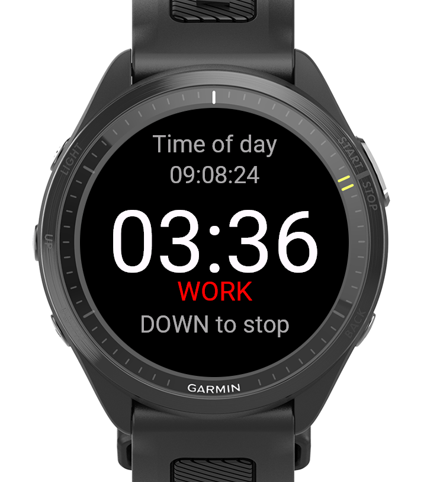

# Pomodoro Workout

A Pomodoro timer app for Garmin wearable devices that helps users manage work sessions with customizable work and break intervals.



## Features

- **Time of Day**: Clock display (HH:MM:SS) above the timer
- **Timer**: Customizable work/break blocks with visual countdown
- **Alert Popup**: Custom popup with Start Work / Start Break / Dismiss options when blocks complete
- **Timer Resume**: Timer stops when exiting app, resumes from saved position when returning
- **State Persistence**: Work time, break time, and history are saved when exiting app
- **Customizable Settings**: Long-press MENU to access settings menu
- **Work Time**: Adjustable duration (default: 25 min)
- **Break Time**: Adjustable duration (default: 5 min)
- **History**: 7-day bar graph showing completed work blocks

## Controls

| Button | Action |
|--------|--------|
| **START / ENTER** | Start a work block immediately |
| **DOWN** | Stop/reset timer |
| **MENU (long-press)** | Open settings menu |
| **UP/DOWN** (on alert) | Navigate between options |
| **ENTER** (on alert) | Select option |
| **ESC/BACK** (on alert) | Dismiss and return to main screen |

## Settings Menu

- **Work Time**: Set work duration (wraps around)
- **Break Time**: Set break duration (wraps around)
- **History**: View 7-day completion graph

## Supported Devices

| Device | Product ID | Resolution | Display Type |
|--------|------------|------------|--------------|
| Forerunner 255 | `fr255` | 260×260 | MIP |
| Forerunner 255 Music | `fr255m` | 260×260 | MIP |
| Forerunner 255s | `fr255s` | 218×218 | MIP |
| Forerunner 255s Music | `fr255sm` | 218×218 | MIP |
| Forerunner 570 | `fr57047mm` | 260×260 | MIP |
| Forerunner 970 | `fr970` | 240×240 | MIP |
| Venu 2 Plus | `venu2plus` | 416×416 | AMOLED |

## Connect IQ SDK

**Version**: Connect IQ 9.1.0

## Building

### Prerequisites

- Connect IQ SDK 9.1.0 installed
- Developer key (`developer_key` file in workspace root)

### Build Commands

```bash
# For FR970
monkeyc -f pomodoro_workout/monkey.jungle -o pomodoro_workout/bin/pomodoro_workout.prg -d fr970 -y developer_key

# For FR570
monkeyc -f pomodoro_workout/monkey.jungle -o pomodoro_workout/bin/pomodoro_workout.prg -d fr57047mm -y developer_key

# For FR255 / FR255 Music
monkeyc -f pomodoro_workout/monkey.jungle -o pomodoro_workout/bin/pomodoro_workout.prg -d fr255 -y developer_key
monkeyc -f pomodoro_workout/monkey.jungle -o pomodoro_workout/bin/pomodoro_workout.prg -d fr255m -y developer_key

# For FR255s / FR255s Music
monkeyc -f pomodoro_workout/monkey.jungle -o pomodoro_workout/bin/pomodoro_workout.prg -d fr255s -y developer_key
monkeyc -f pomodoro_workout/monkey.jungle -o pomodoro_workout/bin/pomodoro_workout.prg -d fr255sm -y developer_key

# For Venu 2 Plus
monkeyc -f pomodoro_workout/monkey.jungle -o pomodoro_workout/bin/pomodoro_workout.prg -d venu2plus -y developer_key
```

### Running in Simulator

```bash
# Launch simulator
open "/Users/<username>/Library/Application Support/Garmin/ConnectIQ/Sdks/connectiq-sdk-mac-9.1.0-2026-03-09-6a872a80b/bin/ConnectIQ.app"

# Run app
monkeydo pomodoro_workout/bin/pomodoro_workout.prg fr970
```

## Project Structure

```
pomodoro_workout/
├── manifest.xml                   # App manifest (watch-app type)
├── monkey.jungle                 # Build configuration
├── source/
│   ├── PomodoroApp.mc            # Main app class
│   ├── PomodoroView.mc           # Timer display UI with time of day
│   ├── PomodoroDelegate.mc       # Input handling
│   ├── AlertView.mc              # Custom alert popup view
│   ├── AlertDelegate.mc          # Alert popup input handling
│   ├── SettingsView.mc           # Settings screen
│   ├── SettingsDelegate.mc       # Settings input
│   ├── HistoryView.mc            # 7-day history graph
│   └── HistoryDelegate.mc        # History input
└── resources/
    ├── strings.xml               # App strings
    ├── drawables.xml             # Icon configuration
    └── images/
        └── launcher_icon.png    # App icon
```

## Technical Details

- **App Type**: Watch App (standalone)
- **Language**: Monkey C
- **Storage**: Application.Storage (persists timer state, settings, history)
- **Timer**: Toybox.Timer (1-second interval)
- **Alert System**: Custom AlertView popup with vibration and alarm tone

## License

See LICENSE file for details.
